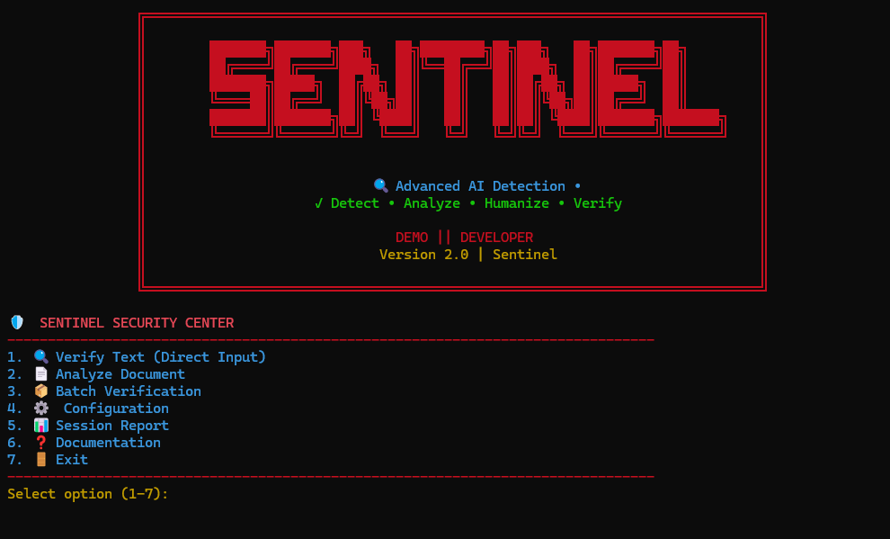

# 🔥 SENTINEL - AI Content Verification Platform


                                    ███████╗███████╗███╗   ██╗████████╗██╗███╗   ██╗███████╗██╗
                                    ██╔════╝██╔════╝████╗  ██║╚══██╔══╝██║████╗  ██║██╔════╝██║
                                    ███████╗█████╗  ██╔██╗ ██║   ██║   ██║██╔██╗ ██║█████╗  ██║
                                    ╚════██║██╔══╝  ██║╚██╗██║   ██║   ██║██║╚██╗██║██╔══╝  ██║
                                    ███████║███████╗██║ ╚████║   ██║   ██║██║ ╚████║███████╗███████╗
                                    ╚══════╝╚══════╝╚═╝  ╚═══╝   ╚═╝   ╚═╝╚═╝  ╚═══╝╚══════╝╚══════╝


## 🛡 Overview

**Sentinel** is an advanced AI Content Verification Platform built with Python for detecting AI-generated text, humanizing content, analyzing plagiarism, and generating explainable verification reports.

Inspired by modern cybersecurity workflows, Sentinel combines Natural Language Processing (NLP), heuristic AI detection, document automation, and intelligent reporting into a modular command-line platform capable of processing both individual documents and large batches efficiently.

**Status:** Active Development  
**Version:** 2.0  
**Language:** Python 3.10+  
**Platform:** Windows • Linux • macOS

---

## 📸 Preview




---

# ⚡ Core Features

## 🤖 AI Detection

- AI Probability Scoring
- Pattern-Based Detection
- Sentence Structure Analysis
- Vocabulary Diversity Analysis
- Explainable AI Signals
- Confidence Reports

---

## ✍ Humanization

- Low Humanization
- Medium Humanization
- High Humanization
- Natural Sentence Rewriting
- Tone Preservation
- Meaning Preservation

---

## 📄 Document Processing

- TXT Support
- DOCX Support
- PDF Analysis
- Batch Processing
- Folder Processing
- Automated Reports

---

## 🔍 Plagiarism Analysis

- Local Similarity Detection
- Repeated Phrase Analysis
- Risk Assessment
- Uniqueness Score
- Plagiarism Reduction Tracking

---

# 📦 Components

## `unified_humanizer.py`

Main application

- AI Detection
- Humanization
- Plagiarism Analysis
- Batch Processing
- Report Generation

---

## `main.py`

Command Line Interface

- Humanize Text
- Detect AI
- Analyze Documents
- Batch Operations

---

## `src/humanizer/`

Core Engine

- ai_detector.py
- humanizer_engine.py
- plagiarism_checker.py
- text_processor.py

---

## `src/document_handler/`

Document Engine

- DOCX Processing
- PDF Reading
- TXT Support
- Readability Analysis

---

# 🚀 Quick Start

## Installation

```bash
git clone https://github.com/USERNAME/Sentinel.git

cd Sentinel

pip install -r requirements.txt
```

Download NLTK

```bash
python -m nltk.downloader punkt averaged_perceptron_tagger
```

---

## Launch

```bash
python unified_humanizer.py
```

Humanize Text

```bash
python unified_humanizer.py "Your AI text here"
```

Analyze Document

```bash
python unified_humanizer.py document.docx -r
```

Batch Processing

```bash
python unified_humanizer.py -b ./input -o ./output
```

---

# 🧠 Detection Pipeline

```
Input Document
        │
        ▼
Document Processor
        │
        ▼
Text Extraction
        │
        ▼
AI Detection Engine
        │
        ▼
Sentence Analysis
        │
        ▼
Humanization Engine
        │
        ▼
Plagiarism Analysis
        │
        ▼
Verification Report
```

---

# ⚙ Detection Techniques

Sentinel combines multiple NLP heuristics:

- Pattern Matching
- Lexical Diversity
- Sentence Uniformity
- Readability Analysis
- Formatting Detection
- Explainable AI
- Rule-Based Confidence Scoring

---

# 📊 Reports

Generated Reports Include

- AI Probability
- Humanization Score
- Plagiarism Score
- Uniqueness Percentage
- Readability Metrics
- Sentence-Level Explainability
- Processing Statistics

---

# 📋 CLI Commands

```text
sentinel detect <text>

sentinel humanize <text>

sentinel plagiarism <text>

sentinel analyze document.docx

sentinel batch ./input

sentinel config

sentinel report
```

---

# 🏗 Architecture

```
                 User Input
                      │
                      ▼
          Unified CLI Interface
                      │
      ┌───────────────┼───────────────┐
      ▼               ▼               ▼
 AI Detector   Humanization    Document Engine
      │               │               │
      └───────────────┼───────────────┘
                      ▼
          Plagiarism Analysis
                      │
                      ▼
          Verification Report
```

---

# 💻 Technologies

### Programming

- Python

### NLP

- NLTK
- Regex

### Document Processing

- python-docx
- PyPDF2

### Core

- argparse
- JSON
- OOP
- CLI Development
- Batch Processing
- File Handling

### Testing

- PyTest
- Unittest

---

# 📂 Project Structure

```
Sentinel/

config/

src/

tests/

unified_humanizer.py

main.py

requirements.txt

README.md
```

---

# 🎯 Roadmap

- FastAPI REST API
- Web Dashboard
- Machine Learning Detection
- Real-Time Editor
- OCR Support
- Cloud Storage
- Multi-language Support
- Browser Extension

---

# 🛡 Legal Notice

Sentinel is intended solely for educational, research, and defensive applications.

Users are responsible for ensuring compliance with applicable laws, institutional policies, and academic integrity requirements when using this software.

---

## License
All rights reserved. This repository is shared for viewing only; no license is granted for reuse, modification, or redistribution.

# 👨‍💻 Developer

**AHMED HUSSAIN**

                                                               **Demo || Developer**  
 

                                            Red Hat Hacker • Full Stack Developer • Security Researcher

                                       *"Advanced mobile security research tools for authorized professionals"*

> **Think. Verify. Improve. Secure.**

---


## ⭐ Support

If you find this project useful, consider giving it a ⭐ on GitHub.

---

**Version:** 2.0  
**Status:** Active Development
